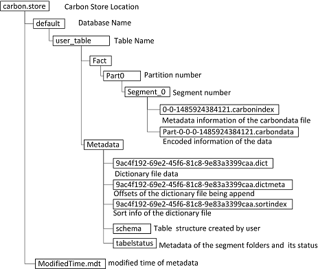

2 **format模块**

2.1 **文件目录结构**

CarbonData数据存储在carbon.storelocation配置项指定的位置（在carbon.properties中配置；若未配置则默认为../carbon.store）。

 文件目录结构如图2-1_1所示：

1. carbon.store目录是CarbonData数据存储位置，其下database目录（default database name：default）和_system目录(datamap元数据信息)。

2. default目录下有属于该database的用户表目录（例如：carbon_table  ）。

3. carbon_table目录下有Metadata, Fact, LockFiles 以及datamap数据目录
    
4. Metadata目录下存储schema文件，tablestatus和字典文件（包括.dict，.dictmeta和.sortindex）共三类元数据数据信息文件。

5. Fact目录下存储数据和索引文件，Fact目录有Part0分区目录，其中0是分区编号。
    
6. Part0目录下有Segment_0目录，其中0是segment编号。
    
7. Segment_0目录下有carbondata和carbonindex两类文件。

2.2 **文件内容详解**

创建表时，生成user_table目录，并在Metadata目录下生成schema文件，用于记录表结构。

批量加载数据时，每一次批量loading生成一个新的segment目录，调度尽量控制在每个node上启动一个task处理数据加载任务，每个task将生成多个carbondata文件和一个carbonindex文件。

关于全局字典，若采用two-pass方案，在数据加载前，首先为每个字典编码的列生成对应的dict,dictmeta和sortindex三个文件，可以采用pre-define dictionary方式提供部分字典文件以减少需要通过扫描全量数据生成字典编码的列；也可以采用all dictionary方式提供所有字典编码列的字典文件以避免扫描数据。若采用single-pass方案，在数据加载期间，实时生成全局字典编码，数据加载结束后，讲字典固化到字典文件。
 
下面小节依次采用描述carbondata文件格式的thrift文件编译后生成的Java对象逐一详解各个文件内容（也可以直接阅读[格式定义的thrift文件](https://github.com/apache/incubator-carbondata/tree/master/format/src/main/thrift)或者[官网的数据格式介绍](https://github.com/apache/incubator-carbondata/blob/master/docs/file-structure-of-carbondata.md)了解carbondata数据格式）。

2.2.1 **Schema文件格式**

schema文件内容如图2-2_1中TableInfo类所示:

1. TableSchema类 
    TableSchema类并没有记录表名，表名user_table目录名决定。
    其中tableProperties用来记录table相关的属性， 例如：table_blocksize。

2. ColumnSchema类
    encoders用来记录column存储时采用的编码
    columnProperties用来记录column相关的属性。

3. BucketingInfo类
    创建bucket表时可以指定表的bucket数量以及column来splitbuckets。

4. DataType类
    描述了CarbonData支持的数据类型。

5. Encoding类
    CarbonData文件可能用到的几种编码。

2.2.2 **carbondata文件格式**

carbondata文件由多个blocklet和footer部分组成。blocklet是carbondata文件内部的数据集（最新V3格式，默认配置是64MB）， 每个blocklet包含每个列的一个ColumnChunk，一个ColumnChunk可能包含一个或多个Column Page。

carbondata文件目前支持V1，V2和V3版本，主要区别在于blocklet部分的变化，下面逐一介绍。

**blocklet部分**
 V1: 
 blocket由所有column的data page, RLE page,rowID page组成。由于blocklet内的page是按照page类型聚集在一起的，因此每个column的这3部分数据是在blocklet内分散存储的，在footer部分需要记录全部page的offset和length信息。

V2:
blocklet由所有列的ColumnChunk组成，一个列的ColumnChunk由一个ColumnPage组成，ColumnPage包括data chunk header，data page, RLE page和rowID page。由于ColumnChunk将column的3类Page数据聚集在了一起， 因此，能使用更少的reader完成column数据读取。由于header部分记录了全部page的长度信息，因此，footer部分只需记录ColumnChunk的offset和length，也减小了footer数据量。

V3:
blocklet也是由所有列的ColumnChunk组成。变化的是一个ColumnChunk由一到多个Column Page组成，Column Page新增加了BlockletMinMaxIndex。

与V2相比: V2格式的blocklet数据量默认为120000行，而V3格式的blocklet数据量默认为64MB，同样大小的数据文件，footer部分索引元数据信息量可能进一步减少；同时V3格式新增page level的数据过滤，而且每个page数据量默认只有32000行，比V2格式的120000行少了很多，数据过滤的命中精度进一步提示，在解压数据之前，能过滤掉更多的数据。

**footer部分**

footer记录每个carbondata
file内部全部blocklet数据分布信息以及统计相关的元数据信息(minmax,startkey/endkey)。

1.  BlockletInfo3用来记录全部ColumnChunk3的offset 和length。

2.  SegmentInfo用来记录column数量以及每个column的cardinality。

3.  BlockletIndex包括BlockletMinMaxIndex和BlockletBTreeIndex。

BlockletBTreeIndex用来记录block内所有blocklet的startkey/endkey;查询时通过过滤条件结合mdkey生成查询的startkey/endkey，借助BlocketBtreeIndex可以圈定每个block内满足条件的blocklet范围。

BlockletMinMaxIndex用来记录blocklet内所有列的min/max值;查询时通过对过滤条件使用min/max检查，可以跳过不满足条件的block/blocklet。

2.2.3 **carbonindex文件格式**

抽取出footer部分中BlockletIndex部分生成carbonindex文件。批量加载数据，调度尽量控制一个node启一个task，每个task生成多个carbondata文件和一个carbonindex文件。carbonindex文件记录对应task生成的所有carbondata文件内部所有blocklet的index信息。

如图，一个block对应的索引信息由一个BlockIndex对象记录，包括了carbondata filename，footer offset和BlockletIndex。BlockIndex数据量要比footer少些，在查询时直接使用该文件在driver侧构建索引，而无需跳扫多个数据文件的数据量更大footer部分。

2.2.4 **dictionary 文件格式**
    
对于每个字典编码列，均采用３文件存储该列的字典元数据。
 
1.  dict file记录某列的distinct value list

首次dataloading时，使用某列的distinct value list生成该文件, 文件内的value是无序的;后续采用追加的方式。在dataloading第二步（Data Convert Step），字典编码列会使用字典key替换数据的真实值（value）。

	
2.  dictmeta记录每次dataloading的新增distinct value的元数据描述

字典缓存使用该信息增量刷新缓存。

	
3.  sortindex记录字典编码按照value排序后的key的结果集。

在dataLoading时，如果有新增的字典值，会使用全部的字典编码重新生成sortindex文件。

基于字典编码列的过滤查询，需要将value的过滤条等价转换为key的过滤条件，使用sortindex文件可以快速构建有序的value序列，以便快速查找value对应的key值，从而加速该转换过程。

2.2.5 **tablestatus 文件格式**

tablestatus记录每次加载和合并的segment相关的信息（采用gson格式），包括加载时间,加载状态,segment名称，是否被删除以及合并入的segment名称等等。每次加载或合并完成后，重新生成tablestatusfile。

