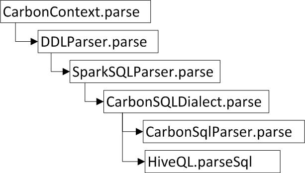
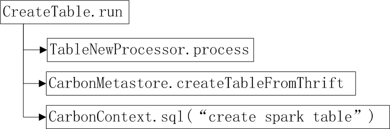
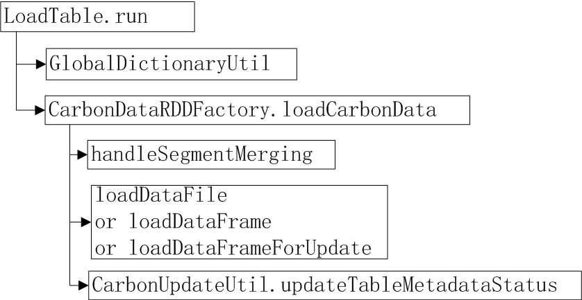
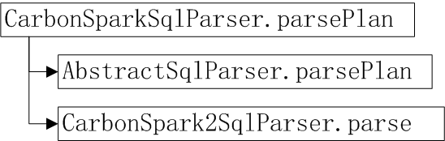

3  **integration模块**

3.1  **spark集成**

在Spark 1.x中，使用CarbonContext作为spark sql接口的入口。CarbonContext扩展了HiveContext,并定制了CarbonSqlParser，部分LogicalPlan, CarbonOptimizer和CarbonStrategy等。

1. CarbonSqlParser用来解析CarbonData的create table , load data等sql语句，具体调用流程如图所示，CarbonSQLDialect优先使用CarbonSqlParser去解析sql（主要包括create table, load table等sql语句）,若无法解析，继续使用HiveQL去解析sql（主要是select查询语句），并生成Carbon LogicalPlan。

2. CarbonData LogicalPlan主要有CreateTable（创建表）和LoadTable（加载数据）。

    CreateTable: TableNewProcessor用于生成carbondata table  schema文件（thrift格式）;CarbonMetastore.createTableFromThrift加载schema文件到元数据缓存中；最后创建Spark table。
    
    
	
    LoadTable: 主要分为generateGlobalDictionary和loadCarbonData两部分:
    
    
	
    generateGlobalDictionary用于生成表级字典编码。
    loadCarbonData用于生成carbondata和carbonindex文件。首先，会依据load,
insert和update操作分别进入loadDataFile, loadDataFrame 和 loadDataFrameForUpdate加载过程生成carbondata和carbonindex文件；其次，CarbonUpdateUtil.updateTableMetadataStatus记录数据加载的tablestatus信息。如果配置了carbon.enable.auto.load.merge=true, 经过多次加载后，在加载前会触发handleSegmentMerging按配置的规则循环合并多个较小segment为一个较大的segment，合并可以有效的防止小文件问题（也可以使用alter table compact命令触发合并）。

3. CarbonOptimizer调整LogicalPlan在需要做字典解码的LogicalPlan前面插入CarbonDictionaryCatalystDecoder
LogcialPlan, 尽可能的延迟解码或者不解码。

4. CarbonStrategy（CarbonTableScan）适配CarbonData相关的LogicalPlan生成SparkPlan，包括：字典延迟解码CarbonDictionaryDecoder, ExecutedCommand(LoadTableByInsert)和表扫描TableScan等。TableScan用于生成CarbonScanRDD，读取CarbonData表数据。

5. CarbonSource是carbondata datasource api, shortname为carbondata；Carbon table
relation为CarbonDataSourceRelation。

6. CarbonEnv：主要作用是初始化加载CarbonData的元数据信息。

3.2  **spark2集成**

在Spark2中，使用CarbonSession作为spark Sql接口的入口。CarbonSession扩展了SparkSession， 包括CarbonSessionState, CarbonSparkSqlParser, CarbonLateDecodeRule和CarbonLateDecodeStartegy，DDLStartegy等。

与spark 1.x相对比，不同点有：

CarbonSparkSqlParser调用流程发生了变化，优先调用spark的AbstractSqlParser解析sql,若无法解析，继续使用CarbonSpark2SqlParser来解析，并生成Carbondata的LogicalPlan。CarbonSpark2SqlParser主要处理Carbondata表上的create table ,load table等sql解析; 目前,Carbondata对select语句未做扩展，仍然由spark AbstractSqlParser来解析, 这样的顺序调整有利于减少查询语句的解析时间。

InsertInto实现方式发生了变化。Spark通过添加Analyzer(CarbonPreInsertionCasts)，并在DDLStrategy中适配为LoadTableByInsert。通过CarbonDatasourceHadoopRelation扩展InserttableRelation来实现的。

Carbon table relation改为CarbonDatasourceHadoopRelation,
改用buildScan方法来生成CarbonScanRDD。
