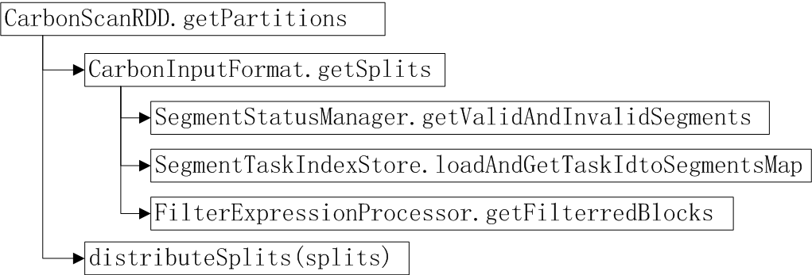
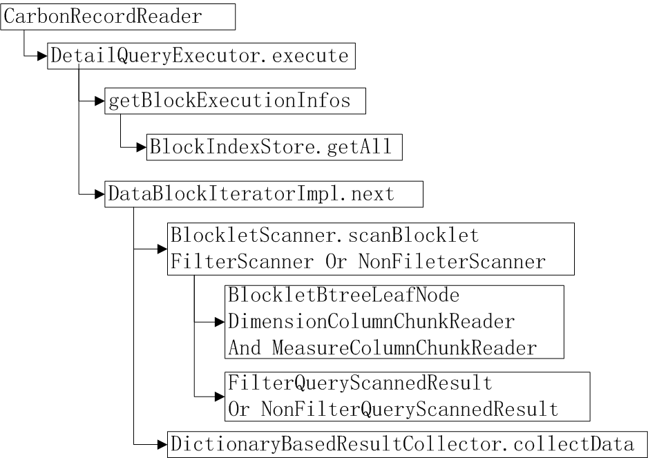
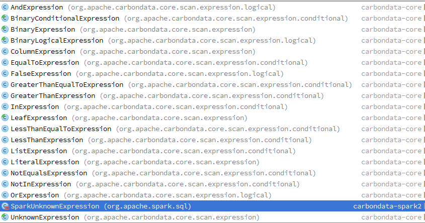
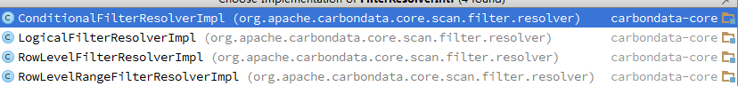
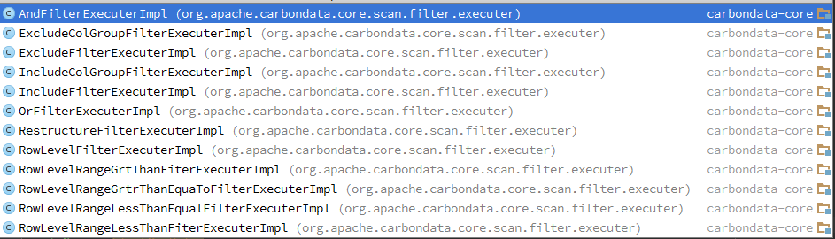
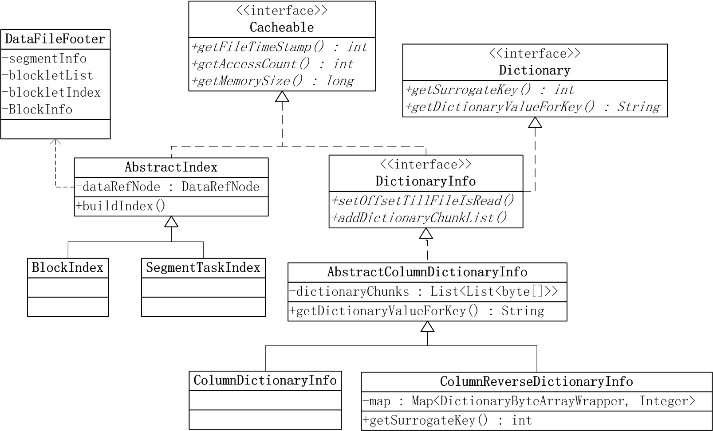
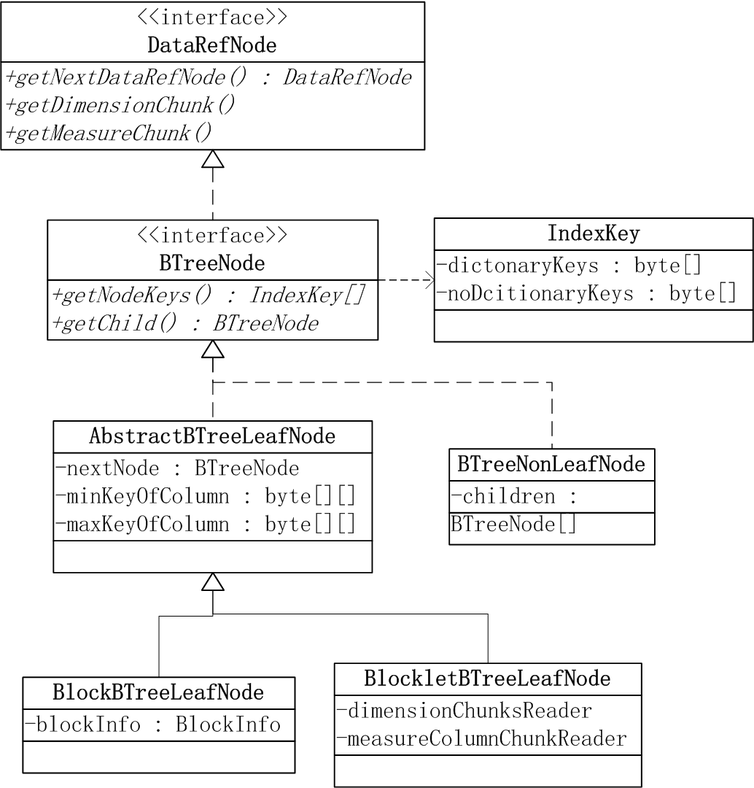
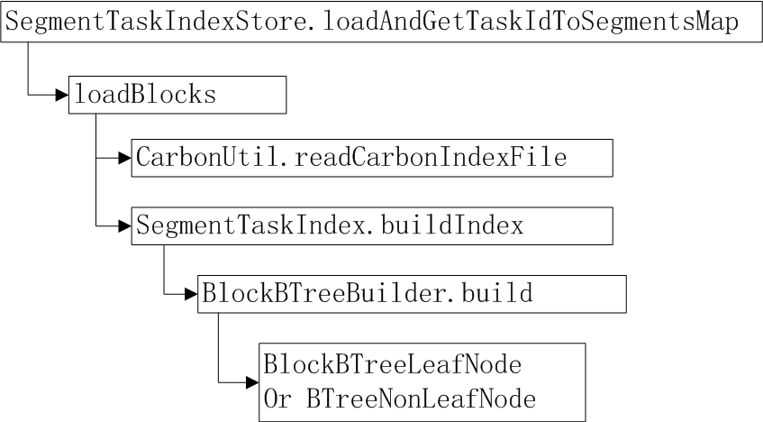
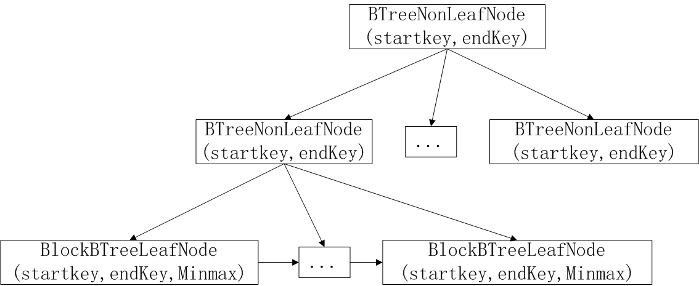
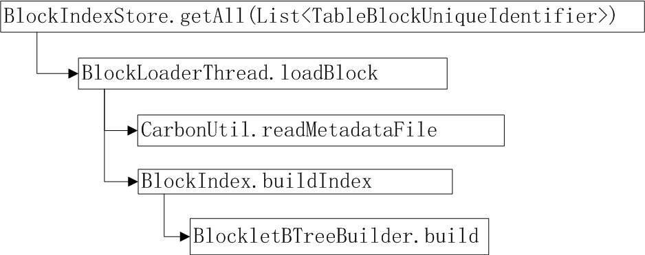

4 **core模块**

4.1 **Scan（查询）**

CarbonScanRDD是Carbon表数据集，用于读取Carbon表数据；关键的method是getPartitions（获取过滤条件命中的部分blocklet的block分块）和compute（扫描blocklet过滤并拼接出数据行的结果集）。

1.  getPartition实现流程图所示。CarbonInputFormat.getSplits方法用来获取查询命中的block分块，其中SegmentStatusManager.getValidAndInvalidSegments方法可以获取carbon表中有效的所有Segment，通过SegmentTaskIndexStore.loadAndGetTaskIdtoSegmentsMap加载segment的carbonindex索引文件，然后FilterExpressionProcessor.getFilterredBlocks从索引信息中查找出被命中的所有block。distributeSplits方法用于将splits根据数据本地化计算原则均匀的按集群节点分组，然后按照分组的结果为所有splits生成SparkPartition.

2.  Compute使用实现流程如图所示。CarbonRecordReader内部封装了DetailQueryExecutor来实现carbon表的detail query。

getBlockExecutionInfos获取各个block上查询执行需要的信息，包括blockindex，startkey,endkey,startBlockletIndex,numberOfBlockletToScan，filterExecuter等。Executor侧BlockIndex由BlockIndexStore.getAll方法加载构建。

DataBlockIteratorImpl.next扫描block获取batchsize行数据。BlockletScanner根据有无过滤条件分为：FilterScanner和NonFilterScanner,BlockletScanner.scanBlocklet使用已缓存的BlocketBTreeLeafNode元数据信息加载命中的blocklet（driver侧传递过来的startblocklet和blocklet数量，以及executer侧使用blocklet级别的minmax检查）内所需列的数据来填充ScannedResult，对于FilterScanner，还会生成过滤条件命中的数据行号索引，返回FilterQueryScannedResult或者NonFilterQueryScannedResult。DictionaryBasedResultCollector调用collectData方法从上一步的result中，将需要的列数据拼接为最后需要的行数据。

4.2 **Filter Expression**

在executer侧内部实现了一套blocklet内列存储数据按表达式过滤的方法。

首先，被pushdown到CarbonScanRDD里的filter
expression,会被转换为如图所示的carbondata的Expression。实现代码：CarbonFilters.createCarbonFilter。

其次，基于上一步的Expression tree生成FilterResolverIntf
tree，子类如下图所示。转换过程代码为：CarbonInputFormatUtil.resolveFilter，执行Expression表达式计算，根据表达式类型将结果封装在不同的FilterResolverIntf中。

接着，基于上一步的FilterResolverIntf tree生成FilterExecuter
tree，子类如下图所示。转换过程代码为：FilterUtil.getFilterExecuterTree,根据FilterResolverIntf中executer类型生成对应的FilterExecuter.

最后，FilterScanner.fillScannedResult调用FilterExecuter.applyFilter计算出过滤条件命中的Blocklet内部数据的行号BitSet，利用RowId
index转换成行号索引。

4.3 **LRU Cache**

CarbonLRUCache根据用途有4种类型，结合下图所示，分别是:

Key-\>Value的ForwardDictionaryCache: 内容为ColumnDcitionaryInfo
Value-\>Key的ReverseDictionaryCache: 内容为ColumnReverseDcitonaryInfo
Driver侧BTree索引缓存SegmentTaskIndexStoree: 内容为 SegmentTaskIndex
Executor侧Btree索引缓存BlockIndexStore: 内容为 BlockIndex

4.4 **BTree Index**

借助cache的索引，来快速命中需要的block和blocklet。索引模型如下图所示，IndexKey包含dicitoanry和nodicitonary列，这也是当前carbondata
dataloading时用到的排序列。BTreeNode中的IndexKey为相关的Block/Blocklet的startKey,endKey。AbstractBTreeLeaf包含了NodeBlock/Blocklet中各列的min/max值。BlockBTreeLeafNode用于driver侧缓存carbonindex信息，BlockletBTreeLeafNode用于executer侧缓存footer信息，并封装了从hdfs读取column
data chunk的方法。

1.  Driver侧index cache由SegmentTaskIndexStore来管理, 索引加载构建过程如图所示，

CarbonUtil.readCarbonIndexFile读取carobnindex文件，SegmentTaskIndex.buildIndex为每个segment的每个task构建一棵索引树。

索引树结构如下图所示，每个BTreeNonLeafNode有不多于32个子节点，其startkey和endkey分别是最左侧的子节点的startkey和最右侧的子节点的endkey。

查询时，首先通过过滤条件计算出startkey,endkey以及minmax值，然后，使用startkey,endkey从树中搜索出符合条件的leafNode节点范围，最后，对于leafNode(对应一个block)使用minmax检查剔除部分block.

1.  Executer侧索引cache由BlockIndexStore来管理，索引加载构建过程如下图所示，CarbonUtil.readMetadataFile读取data file footer

metadata信息，BlockletBtreeBuilder.build为每个block构建一棵索引树。索引树结构与上图类似，leaf node为BlockletBtreeLeafNode.

查询时,首先使用driver侧传递过来的start blocklet和blocklet数量，结合executer侧BlockletBtree确定需要scan的blocklets，并使用blocklet级别的minmax检查跳过不符合条件的blocklet。
