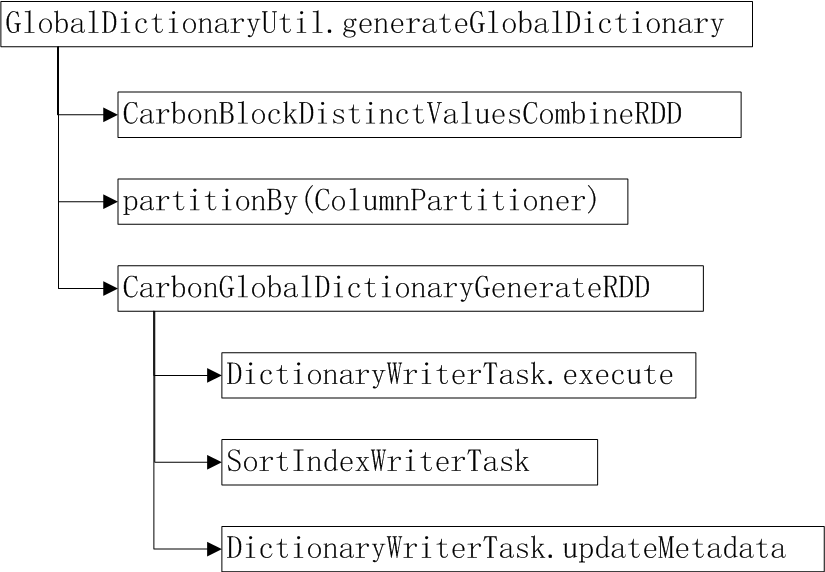
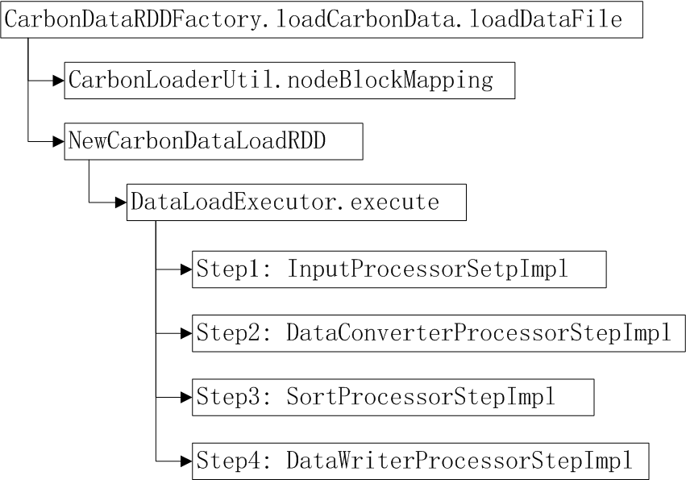
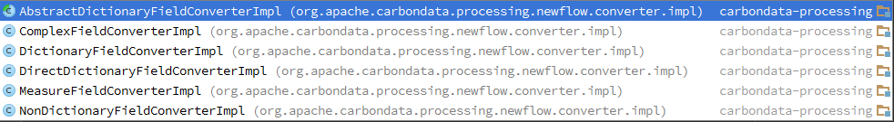
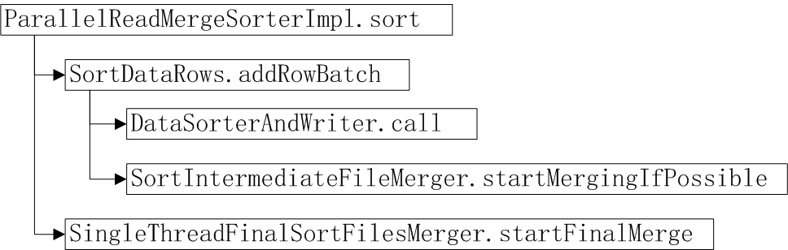
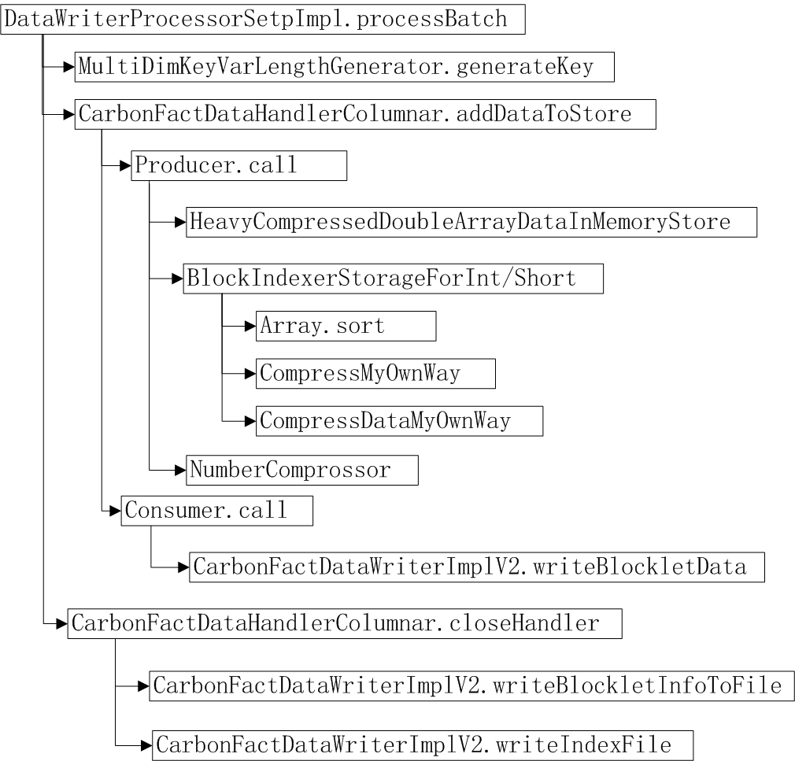

5  **processing模块**

5.1  **Global Dictionary**

全局字典编码（目前为表级字典编码）使用统一的整数来代理真实数据，可以起到数据压缩作用，同时基于字典编码分组聚合的计算也更高效。全局字典编码生成过程如图所示，CarbonBlockDistinctValuesCombinRDD计算每个split内字典列的distinct value列表， 然后按照ColumnPartitioner做shuffle分区，每列一个分区。CarbonGlobalDictionaryGenerateRDD每个task处理一个字典列，生成字典文件（或者追加新字典值），刷新sortindex,更新dictmeta。

5.2  **DataLoading（数据加载）**

CSV文件数据加载主流程，如下图所示。首先，CarbonLoaderUtil.nodeBlockMapping将数据块按节点分区。NewCarbonDataLoadRDD采用该节点分区，每个节点启动一个task来处理数据块的加载。DataLoadExecutor.execute执行数据加载，主流程包括图中所示的4个步骤。

Step1:InputProcessorStepImpl使用CSVInputFormat.CSVRecordReader读取并解析CSV文件。

Step2:DataConverterProcessStepImpl用来转换数据，FieldConverter主要有以下实现类，包括字典列，非字典列，直接字典，复杂类型列和度量列转换。

Step3: SortProcessorStepImpl将数据按照dimension sort，默认的Sorter实现类是ParallelReadMergeSorterImpl, Sorter主流程如右图所示。

SortDataRows.addRowBatch方法缓存数据，当数据记录数达到sort buffer size（默认100000）, 调用DataRorterAndWriter 排序并生成tmp file到local disk;当tmpfile数量达到配置的阈值（默认20）调用SortIntermediateFileMerger.startMerge将这些tmpfile归并排序生成big tmp file. 在Step1和Step2的输入数据都完成排序并生成文件（一些big tmpfile
和不到20个的tmpfile）到tmp目录后，SingleThreadFinalSortFilesMerger.startFinalMerge启动finalmerge，流式归并排序所有的tmpfile,目的是使本节点本次loading的数据有序，并为后续Step4提供数据的流式输入。

Step4:DataWriterProcessorStepImpl用于生成carbondata和carbonindex文件。主流程如下图所示。MultiDimKeyVarLengthGenerator.generateKey为每一行的字典编码dimesion生成MDK。CarbonFactDataHandlerColumnar.addDataToStore缓存MDK编码等数据，记录数达到blockletsize大小后，调用Producer生成Blocklet对象(NodeHolder)。

BlockIndexerStorageForInt/Short处理blocklet内dimension列数据的排序(Array.sort)、生成RowId index(compressMyOwnWay),采用RLE压缩(compressDataMyOwnWay)

HeavyCompressedDoubleArrayDataInMemoryStore处理bloclet内meause类数据的压缩(使用snappy)。

CarbonFactDataWriterImplV2.writerBlockletData将已有的一个blocklet数据写入本地数据文件。如果blocklet累计大小已经达到了table\_blocksize大小，新建carbondata来写入数据。

在carbondata file的blocklet写入结束后，调用writeBlockletInfoToFile完成footer部分写入。在本节点task结束后，调用writeIndexFile生成carbonindex文件。

5.3  **Compression Encoding**

1. Snappy Compressor

2. Number Compressor

3. Delta Compressor

4. Dictionary Encoding

5. Direct-Ditionary Encoding

6. RLE(Running Length Encoding)
